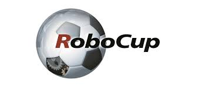
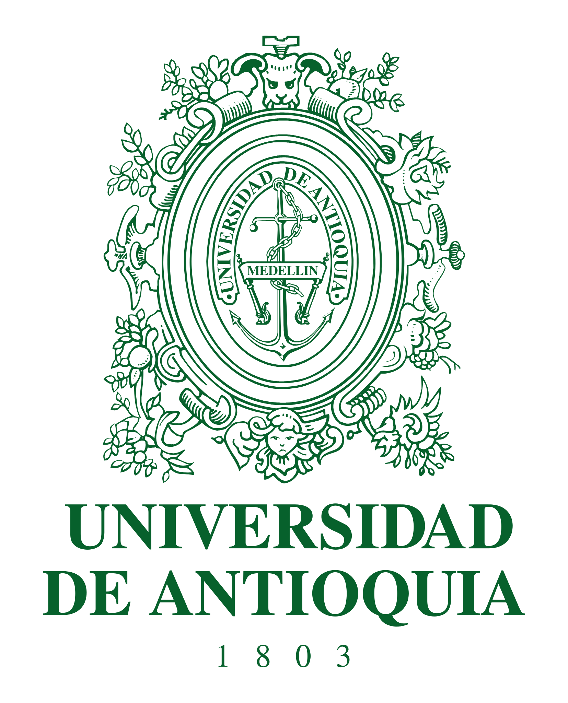

<p align="center">
  
  
  
</p>

<h1 align="center">RoboCup Striker</h1>

<p align="center">
  Comprehensive repository for the <strong>Omniwheel robot Striker</strong>, developed as part of the RoboCup research and competition framework.  
  The project integrates low-level control, perception, and navigation modules for a holonomic mobile robot based on three Omniwheels.
</p>

---

## 🧩 Overview

The **RoboCup_Striker2** system is structured into multiple submodules — each representing a core function of the robot’s embedded and software stack.  
These mini-projects converge into the **[Robot-Navigation](./Robot-Navigation)** module, which acts as the main integration layer.

The system is designed for:
- Real-time control of a 3-wheel Omniwheel robot.  
- Sensor fusion of **Encoder**, **IMU**, and **Lidar**.  
- Modular communication via UDP between robot and local server.  
- High-level trajectory tracking and obstacle avoidance.  

---

## 🎥 Demonstration
Below is a short demonstration of the Striker robot executing a **circular trajectory** command send via udp server:  
- Radius: **20 cm**  
- Linear velocity: **25 cm/s**  
- Total rotations: **2**

<p align="center">
  <video src="assets/Omniwheel Robot_Demostration.mp4" width="150" controls></video>
</p>

---

## 📁 Repository Structure

Each of the first three folders represents an independent subproject, while **[Robot-Navigation](./Robot-Navigation)** is the final integration module that combines and extends everything developed in **[Velocity-Control](./Velocity-Control)** and **[Robot-Control](./Robot-Control)**.


| Folder | Description | Sensors / Functions |
|:--|:--|:--|
| `Velocity-Control` | Low-level control and estimation module. Uses Encoder + IMU + Lidar to estimate motor velocity and position over a 1.2 m rail. Implements **sensor fusion** and **state estimation** (velocity and position). | Encoder, IMU, Lidar |
| `Robot-Control` | Executes velocity and position control of the three Omniwheels. Receives motion commands from the UDP server and applies **inverse kinematics** to generate wheel references. Each wheel has a **Kalman Filter** and **PID** controller. | Encoder |
| `Robot-Navigation` | Central module integrating navigation, localization, and motion control. Receives trajectory/command data from the vision system through a **local server** (`server_test`). Implements **Kalman filtering**, **sensor fusion**, **direct & inverse kinematics**, and **PID control cascades**. | Encoder, IMU |
| `udp_server` | UDP communication interface between robot and control station. Handles transmission of velocity commands and telemetry data. | — |
| `server_test` | Local navigation server simulating the vision system. Sends [vbx, vby, wb] commands to the robot. | — |
| `Drivers` | Hardware drivers and low-level interfaces for sensors and motors (HAL layer). | — |

---

## ⚙️ Hardware Setup

- **Microcontroller:** ARM Cortex-based (e.g., STM32 or Raspberry Pi Pico 2)  
- **Motors:** 3 Brushless DC motors with Omniwheels  
- **Wheel radius:** 3 cm  
- **Base diameter:** 18 cm  
- **Wheel height from base:** 4 cm  
- **Sensors:**  
  - Incremental encoders (AS5600)
  - 9-DOF IMU (accelerometer + gyroscope + magnetometer) (BNO055)  
  - Lidar distance sensor (VL53L1X)

The coordinate reference system is centered at the robot’s chassis.

---

## 🧩 Software and Tools

- **Languages:** C / C++ / Python  
- **Frameworks / Libraries:**  
  - STM32 HAL or Pico SDK  
  - Python UDP sockets (for server modules)  
  - Numpy, Matplotlib (for data analysis and visualization)  
- **Operating Systems:**  
  - Embedded firmware on MCU  
  - Linux/Windows for navigation and server components  

---

## 🧮 Core Features

- **State Estimation:**  
  Fusion of Encoder + IMU (and optionally Lidar) for velocity and position estimation.

- **Control Architecture:**  
  - PID controllers for each wheel  
  - Kalman filter for sensor noise reduction  
  - Cascade control in the navigation layer (position → velocity → wheel velocity)

- **Kinematics:**  
  - Direct and inverse Omniwheel kinematics  
  - Conversion between robot-body frame and wheel-frame velocities  

- **UDP Communication:**  
  Bidirectional protocol for:
  - Sending robot telemetry to local server  
  - Receiving body velocity commands `[vbx, vby, wb]`  

---

## 🚀 How to Run

```bash
# Clone the repository
git clone https://github.com/MaverickST/RoboCup_Striker2.git
cd RoboCup_Striker2

# Build (example)
cd Robot-Navigation
make all   # or use your preferred toolchain

# Run UDP and Navigation servers
python3 udp_server/udp_server.py &
python3 server_test/server_test.py
```

Each module provides serial or UDP outputs for telemetry and debugging.

---

## 📊 Documentation and Diagrams

Detailed diagrams are available in the `Robot-Navigation/docs` folder:

- Hardware architecture diagram  
- Task scheduling diagram  
- Software modular design  
- Cascade control structure  

Each subproject (`Velocity-Control`, `Robot-Control`, `Robot-Navigation`) includes its own **README.md** for detailed explanation and setup.

---

## 🧪 Testing and Validation

- Step response and trajectory tracking tests  
- Sensor fusion validation (IMU vs Encoder vs Lidar)  
- PID tuning and Kalman filter verification  
- Real trajectory experiments with the Omniwheel robot  

**Performance metrics:**
- RMSE  
- Overshoot  
- Settling Time  
- Control Effort  
- Computation Time  

---

## 👨‍💻 Authors

Developed by:
- **Maverick Sossa** – Control systems, navigation algorithms, and embedded software
- **Kevin Jimenez** – Embedded software, hardware and python development
- **Benjamin Ruiz** – Hardware development, and Python algorithms
- **Collaborators** – Robotics Research Group SISTEMIC, Tournament Team Howlers, University of Antioquia  

---

## 📜 License

This project is released under the **MIT License**.  
See the [`LICENSE`](./LICENSE) file for details.
