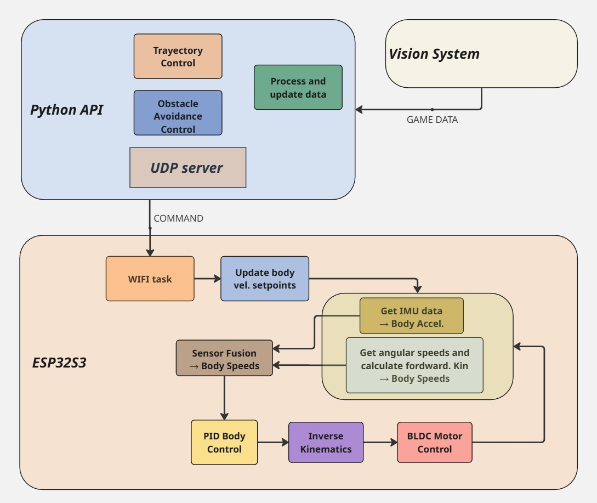

# 🧭 Robot-Navigation

This module implements the **high-level navigation system** of the **Omniwheel robot Striker**, integrating perception, motion control, and communication subsystems.  
It represents the final stage of development, building upon the foundations established in [Velocity-Control](../Velocity-Control) and [Robot-Control](../Robot-Control).

---

## ⚙️ System Overview

The navigation system enables the robot to:
- Receive motion commands from a **local navigation server** (e.g., trajectory tracking or obstacle avoidance).  
- Process onboard sensor data (**IMU + encoders**) for accurate **state estimation** via Kalman filters and sensor fusion.  
- Execute coordinated movements through inverse kinematics and cascaded PID control.

---

## 🧠 System Architecture

The complete navigation stack is divided into **three functional levels**:

1. **Vision System** – External module from the RoboCup environment. Detects objects and sends target coordinates to the local server.  
2. **Local Server ([server_test](../server_test/))** – Implements trajectory generation, path tracking, and obstacle avoidance. Sends velocity commands `[vbx, vby, wb]` to the robot.  
3. **Robot (ESP32-S3)** – Executes real-time control using FreeRTOS tasks, sensor fusion, and cascaded PID controllers.

<p align="center">
  
</p>

---

## 🔩 Hardware Setup

**Main components:**
- **MCU:** ESP32-S3 (dual-core, FreeRTOS-based)  
- **Motors:** 3 × BLDC motors with integrated speed controllers  
- **Encoders:** 3 × AS5600 magnetic encoders  
- **IMU:** Bosch BNO055 (sensor fusion and attitude estimation)  
- **Wheels:** 3 × Omniwheels (120° apart)  
- **Power:** 6S Li-Po battery  

<p align="center">
  
</p>

---

## 🧵 Task Management (FreeRTOS)

The ESP32-S3 executes multiple **real-time tasks** under FreeRTOS, each one responsible for a specific subsystem.  
The figure below illustrates how tasks interact through message queues and periodic timers.

<p align="center">
  
</p>

# 🧠 Task Description

| **Task** | **Description** | **Triggers / Timing** | **Communication** |
|-----------|-----------------|------------------------|--------------------|
| **Init System** | Initializes all peripherals, sensors, communication interfaces, and creates FreeRTOS tasks. | Runs once at startup | Initializes system |
| **WIFI Command Task** | Receives body velocity setpoints `[vbx, vby, wb]` from the local navigation server through UDP. | Triggered by incoming messages | Sends body setpoints to `Robot Control Task` |
| **BNO055 Task** | Reads IMU data and applies a **Kalman filter** for attitude estimation and acceleration filtering. | Periodic timer (10 ms) | Sends filtered accelerations to `Robot Control Task` |
| **Robot Control Task** | Core control layer performing **sensor fusion**, **forward & inverse kinematics**, and **PID control** at the body level. | Runs continuously | Receives IMU + body setpoints, outputs wheel targets to `BLDC Control Task` |
| **BLDC Control Task** | Executes **per-wheel PID control** with individual **Kalman filters** for velocity estimation. | Periodic timer (1 ms) | Sends wheel data feedback to `Robot Control Task` |
| **UART Task** | Handles serial communication for telemetry and debugging. | Asynchronous | Outputs diagnostic data |

---

Each task operates concurrently and exchanges data via **queues** (e.g., accelerations, setpoints, wheel velocities), ensuring deterministic control and synchronization.  
Periodic timers provide precise triggering for high-frequency control loops (1 ms and 10 ms), while lower-frequency communication tasks handle command reception and logging.

---

## 🔧 Control and Estimation Structure

The control scheme integrates both **estimation** and **control loops**, combining data from multiple sensors for reliable motion control.

<p align="center">
  
</p>

---

## 🧪 Validation and Testing

Experimental tests included:

- **Trajectory tracking** for linear and circular paths.  
- **Sensor fusion validation** (comparison between IMU, encoder-only, and fused estimates).  
- **Disturbance rejection** analysis using cascaded PID structure.  
- **Metrics evaluated:**
  - RMSE (position error)  
  - Overshoot  
  - Settling time  
  - Control effort  
  - Computation time  

---

## 🚀 How to Run

```bash
# Open project directory
cd Robot-Navigation

# Build and deploy firmware to ESP32-S3
idf.py build
idf.py flash
```

On the host PC:
### Start navigation server
```bash
cd ../server_test
python3 server_test.py
```

---

## 📂 Documentation and Diagrams

Additional detailed diagrams and reports can be found in [assets](../assets):
- Hardware architecture diagram
- Task scheduling (FreeRTOS)
- Software modular architecture
- Cascaded control structure
- Sensor fusion explanation

---

## License

This project inherits its license from the root repository. See the LICENSE file in the root of the repo.

---

© 2025 Striker2 